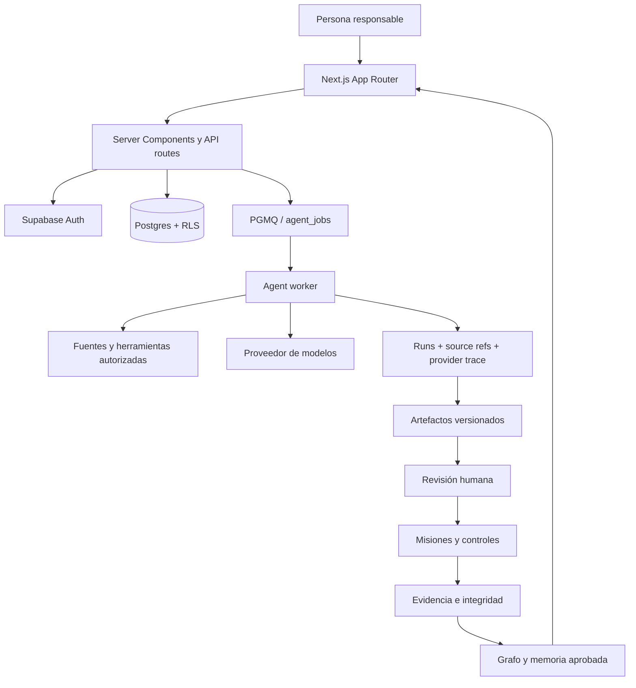

<p align="center">
  <strong>KUMPLIO</strong>
</p>

<h1 align="center">Protección de datos y privacidad para Chile, con evidencia y revisión humana.</h1>

<p align="center">
  Kumplio ayuda a organizaciones en Chile a prepararse para la Ley 21.719, centralizar tratamientos y proveedores, identificar brechas, coordinar especialistas digitales y convertir cada situación en trabajo trazable.
</p>

<p align="center">
  <a href="https://www.kumplio.app/es"><strong>Ver Kumplio</strong></a>
  ·
  <a href="./ROADMAP.md">Roadmap canónico</a>
  ·
  <a href="./docs/assurance/agent-flow-production-e2e-5x-2026-08-14.md">Agentes 5/5</a>
  ·
  <a href="./docs/assurance/ui-golden-path-production-3x-2026-08-07.md">UI 3/3</a>
  ·
  <a href="https://www.kumplio.app/llms.txt">LLM context</a>
</p>

---

## Qué es Kumplio

Kumplio es una plataforma **Chile-first de protección de datos, privacidad y gestión de cumplimiento**, con foco público inicial en la **Ley 21.719**.

No es un chatbot jurídico ni una colección de checklists. Convierte una situación real en un expediente vivo:

```text
situación
→ contexto autorizado
→ fuentes y evidencia
→ especialistas
→ revisión humana
→ plan operativo
→ responsables y plazos
→ controles y solicitudes de evidencia
→ trazabilidad y aprendizaje aprobado
```

La promesa pública central es:

> **Protege tus datos. Entiende qué hacer. Avanza con una guía clara.**

Kumplio es un producto desarrollado por **n3uralia**, factoría chilena de inteligencia artificial aplicada y software.

---

## Estado actual — 15 de agosto de 2026

| Capa | Estado comprobado |
|---|---:|
| Golden Path productivo por UI | `VALIDATED x3` |
| Flujo agentic productivo controlado | `5/5` etapas |
| Jobs del E2E agentic | `5/5 succeeded · 1 intento` |
| Provider traces del E2E agentic | `5/5` |
| Tool calls fallidos del E2E agentic | `0` |
| Multiempresa interno | `VALIDATED` |
| Actividades reales de tratamiento | 3/3 |
| Lifecycle | `changes_requested` 3/3 |
| Mapeo del aviso | `accepted_with_gaps` 3/3 |
| Mecanismo controlado de eliminación | 3/3 |
| Eliminación primaria operativa | 3/3 |
| Assurance de proveedor | 3/3 |
| Solicitudes tenant-specific | 3/3 |
| Configuración tenant proveedor | 0/3 |
| Eliminación operacional final | 0/3 |
| Sitio público bilingüe | `/es` + `/en` en rutas revisadas |
| Piloto externo | pendiente |
| Beta privada autoservicio | no habilitar todavía |

`VALIDATED`, `5/5` o `3/3` describen únicamente el alcance técnico o de assurance probado. **No significan certificación, cumplimiento integral, asesoría jurídica ni evidencia de un cliente externo.**

---

## Flujo agentic: comprobación productiva 5/5

El 14 de agosto de 2026 se ejecutó un E2E sintético y controlado del workflow `compliance_assessment` en producción.

```text
Isidora
→ Rodrigo
→ Verónica
→ Javier
→ Julieta
→ cierre del workflow
```

Resultado observado:

| Indicador | Resultado |
|---|---:|
| Etapas aprobadas | 5/5 |
| Runs aprobados | 5/5 |
| Jobs durable `succeeded` | 5/5 |
| Jobs al primer intento | 5/5 |
| Artefactos aprobados | 5/5 |
| Revisiones humanas aprobadas | 5/5 |
| Provider traces persistidas | 5/5 |
| Tool calls | 24 |
| Tool calls fallidos | 0 |
| Tokens observados | 129.868 |
| Tiempo de modelo acumulado | 423.650 ms |

También se verificaron:

- PGMQ + `agent_jobs` como cola durable;
- lease y heartbeat durante ejecuciones largas;
- scheduler productivo cada minuto;
- avance de etapa únicamente después de revisión humana;
- aislamiento de dominio SST;
- `skipped` determinístico cuando una herramienta no dispone de filtro de dominio seguro;
- grounding SST oficial con 21 referencias y 9 documentos en la etapa de controles/evidencia;
- recomendación final `request_changes` cuando permanecen contradicciones y reservas.

Evidencia completa: [`docs/assurance/agent-flow-production-e2e-5x-2026-08-14.md`](./docs/assurance/agent-flow-production-e2e-5x-2026-08-14.md).

---

## Qué hace único a Kumplio

1. **Centraliza primero.** La información sensible vive en un expediente controlado.
2. **Separa hechos de conclusiones.** Fuentes, inferencias, reservas, unknowns y decisiones humanas no se mezclan.
3. **Convierte análisis en operación.** Cada gap puede terminar en misión, owner, vencimiento y solicitud de evidencia.
4. **Exige evidencia defendible.** Un documento no acredita por sí solo un control, un aviso ni una eliminación.
5. **Mantiene supervisión humana.** Los especialistas proponen; una persona aprueba, rechaza o solicita cambios.
6. **Versiona antes de sobrescribir.** Cada revisión conserva procedencia, hash, vigencia y supersesión.
7. **Explica la confianza.** Los resultados declaran alcance y límites.
8. **Aprende sin inventar.** Solo el conocimiento aprobado puede convertirse en precedente reutilizable.
9. **Aísla organizaciones y dominios.** El contexto privado y las fuentes de un caso no deben contaminar otro tenant o materia.

---

## Consejo de Especialistas

| Especialista | Función principal |
|---|---|
| **Isidora** | obligaciones, fuentes, evidencia y aplicabilidad |
| **Beatriz** | cambio regulatorio y vigencia |
| **Rodrigo** | riesgo, urgencia e incertidumbre |
| **Verónica** | controles, evidencia y readiness |
| **Javier** | planes, dependencias y criterios de cierre |
| **Andrés** | desempeño y aprendizaje |
| **Julieta** | revisión jurídica, calidad, consistencia y reservas |

Cada agente tiene fronteras explícitas, herramientas autorizadas y salida estructurada. Los resultados relevantes quedan sujetos a revisión humana.

---

## Capacidades actuales

### Workspace y multiempresa

- autenticación y onboarding;
- organizaciones, miembros y roles;
- aislamiento tenant-scoped;
- auditoría de cambios sensibles.

### Expedientes

- situación, contexto, prioridad, owner y estado;
- timeline de eventos;
- documentos, fuentes, controles y evidencia;
- navegación guiada desde el problema hasta el trabajo operacional.

### Ejecución durable

- Supabase Queues / PGMQ;
- jobs persistidos;
- lease y heartbeat;
- retry, recovery y dead-letter controlados;
- runs, artefactos, fuentes, tokens, tiempos y errores persistidos.

### Plan operativo

- expediente → plan operativo;
- misión, owner, prioridad y vencimiento;
- solicitudes de evidencia;
- SLA, delegación, bloqueos y seguimiento.

### Controles y evidencia

- procedencia y vigencia;
- integridad SHA-256;
- suficiencia revisada;
- diseño y operación separados;
- unknowns explícitos.

### Regulatory Evidence Engine

- fuentes oficiales versionadas;
- documentos, versiones y secciones;
- parser versionado;
- source refs propagadas a runs y artefactos;
- separación entre fuente oficial, interpretación y aplicabilidad al cliente.

---

## Bloque 16 — evidencia real y privacidad

El foco público actual es ayudar a organizaciones en Chile a ordenar y ejecutar trabajo de protección de datos con trazabilidad.

El estado de la cadena de evidencia interna es:

```text
mapeo del aviso                    3/3
mecanismo controlado               3/3
eliminación primaria               3/3
assurance proveedor                3/3
requests tenant-specific           3/3
configuración tenant               0/3
eliminación operacional final      0/3
```

### Qué ya está demostrado dentro del alcance probado

- 3/3 mapeos aceptados con brechas;
- 3/3 mecanismos controlados;
- 3/3 ejercicios de eliminación primaria usando registros sintéticos sobre stores productivos;
- 3/3 evidencias de assurance de proveedor;
- provider trace OpenAI persistida en ejecuciones reales;
- flujo agentic 5/5 ejecutado con revisión humana y trazabilidad.

### Qué sigue abierto

1. verificar configuración efectiva de backups/PITR del tenant de base de datos;
2. verificar configuración efectiva de retención del proveedor de modelos;
3. promover configuración tenant solo con evidencia suficiente;
4. ejecutar y revisar eliminación operacional final;
5. resolver base jurídica, retención, destinatarios, subencargados y transferencias;
6. cerrar Leaked Password Protection antes de beta autoservicio;
7. observar una organización externa supervisada antes de convertir assurance interno en evidencia comercial.

No corresponde avanzar al Bloque 17 mientras estos gates permanezcan abiertos.

---

## SEO + GEO + LLMO

Kumplio mantiene una única definición pública de entidad y producto:

```text
Producto: Kumplio
Desarrollador: n3uralia
País principal: Chile
Idioma principal: es-CL
Idioma público alternativo: en
Moneda: CLP
Categoría primaria: protección de datos y privacidad
Categoría secundaria: compliance management
Foco regulatorio inicial: Ley 21.719
```

### Señales implementadas

- metadata por idioma;
- canonical por página;
- `hreflang` recíproco en rutas realmente traducidas;
- `x-default` hacia español;
- Open Graph y Twitter cards;
- JSON-LD con `Organization`, `Brand`, `WebSite` y `SoftwareApplication`;
- geoseñales Santiago / Región Metropolitana / Chile;
- sitemap XML;
- RSS público;
- IndexNow;
- redirects permanentes de URLs legacy;
- robots separado para contenido público y workspace privado;
- páginas privadas con `noindex, nofollow, noarchive`;
- crawler access para discovery público, incluido `OAI-SearchBot`;
- machine-readable public facts y contextos para LLMs.

Google recomienda marcar explícitamente las versiones localizadas y mantener canonicals/hreflang coherentes. Kumplio por eso migra `/es` y `/en` **ruta por ruta**, en vez de publicar prefijos que todavía contienen contenido sin traducir.

### Superficies para buscadores y modelos

| Superficie | URL |
|---|---|
| Contexto LLM corto | `https://kumplio.app/llms.txt` |
| Contexto LLM completo | `https://kumplio.app/llms-full.txt` |
| Facts públicos JSON | `https://kumplio.app/kumplio.json` |
| Sitemap | `https://kumplio.app/sitemap.xml` |
| Robots | `https://kumplio.app/robots.txt` |
| RSS | `https://kumplio.app/feed.xml` |
| Security contact | `https://kumplio.app/.well-known/security.txt` |

`llms.txt`, `llms-full.txt` y `kumplio.json` son superficies auxiliares de discovery. **No sustituyen la página canónica, la fuente legal oficial ni la evidencia humana.**

### Política de URLs bilingües

Las páginas completamente revisadas usan `/es/...` y `/en/...`. Las páginas cuyo copy, metadata, navegación o claims todavía no están migrados conservan su URL canónica sin prefijo.

Esto evita duplicados falsos, traducciones parciales y señales contradictorias para buscadores y modelos.

---

## Footer público

El footer público mantiene datos consistentes en español e inglés:

- posicionamiento de protección de datos y Ley 21.719;
- software de protección de datos;
- solución Ley 21.719;
- resolución guiada;
- demo y planes;
- guías y centro de recursos;
- casos de uso;
- FAQ y metodología;
- About y Enterprise Studio;
- relación Kumplio ↔ n3uralia;
- privacidad, términos y seguridad;
- `llms.txt`, `llms-full.txt` y `kumplio.json`;
- `info@kumplio.app`;
- `+56 9 9382 6127`;
- Santiago, Chile.

La mención **Powered by n3uralia** permanece discreta y única.

---

## Evidencia productiva

- [`Flujo agentic productivo controlado 5/5`](./docs/assurance/agent-flow-production-e2e-5x-2026-08-14.md)
- [`UI Golden Path productivo 3/3`](./docs/assurance/ui-golden-path-production-3x-2026-08-07.md)
- [`Inventario real de N3uralia 3/3`](./docs/assurance/n3uralia-processing-inventory-3x-2026-08-08.md)
- [`Revisión lifecycle 3/3`](./docs/assurance/n3uralia-processing-lifecycle-3x-2026-08-08.md)
- [`Aviso y acciones 3/3`](./docs/assurance/n3uralia-processing-privacy-remediation-3x-2026-08-08.md)
- [`Mapeo del aviso 3/3`](./docs/assurance/n3uralia-processing-notice-mapping-3x-2026-08-08.md)
- [`Eliminación primaria 3/3`](./docs/assurance/n3uralia-primary-deletion-3x-2026-08-08.md)
- [`Assurance de proveedor 3/3`](./docs/assurance/n3uralia-provider-retention-assurance-3x-2026-08-08.md)
- [`Requests tenant-specific 3/3`](./docs/assurance/n3uralia-provider-configuration-requests-3x-2026-08-08.md)

> La evidencia demuestra arquitectura, persistencia, seguridad, trazabilidad e idempotencia dentro del alcance probado. No sustituye revisión legal, auditoría, certificación ni observación de una organización externa.

---

## Arquitectura



### Stack

- **Frontend y backend:** Next.js App Router, React y TypeScript.
- **Datos:** Supabase Auth y Postgres con RLS.
- **IA:** Responses API con salidas estructuradas.
- **Orquestación:** workflows por etapas, PGMQ y worker durable.
- **Despliegue:** Vercel con previews y gates antes de merge.
- **Discovery:** sitemap, robots, IndexNow, JSON-LD, RSS, llms y facts públicos.

---

## Mapa del repositorio

```text
app/                         rutas, metadata, API y discovery
components/                  experiencia y componentes
lib/agents/                  especialistas y runtime
lib/compliance/              expedientes, controles y evidencia
lib/i18n/                    copy y routing público ES/EN
lib/privacy/                 contratos de privacidad
lib/supabase/                acceso a datos
supabase/migrations/         esquema versionado
scripts/                     guardrails y verificaciones
tests/e2e/                   Golden Path
docs/assurance/              evidencia técnica
docs/governance/             reglas de ejecución
docs/operations/             procedimientos operacionales
.github/workflows/           CI, release e IndexNow
ROADMAP.md                   prioridad y estado canónicos
```

---

## Roadmap canónico: trabajar sin desviaciones

[`ROADMAP.md`](./ROADMAP.md) es la **única fuente canónica de prioridad, secuencia y estado**.

Contrato vinculante de gobernanza: [`docs/governance/canonical-roadmap-contract.md`](./docs/governance/canonical-roadmap-contract.md).

Un cambio está autorizado cuando cumple al menos una condición:

1. pertenece al único bloque marcado `NEXT`;
2. cierra un gate `P0` o una tarea `ACTIVE`;
3. corrige un bug, regresión o riesgo de seguridad/integridad;
4. responde a una decisión explícita del owner y actualiza el roadmap en la misma PR cuando cambia estado, prioridad o decisión.

Validación:

```bash
npm run check:canonical-roadmap
```

---

## Desarrollo local

```bash
npm ci
npm run dev
```

Validación principal:

```bash
npm run typecheck
npm run check:discovery
npm run check:canonical-roadmap
npm run release:check
npm run smoke
```

---

## Flujo de contribución

1. Leer [`ROADMAP.md`](./ROADMAP.md), este README y [`AGENTS.md`](./AGENTS.md).
2. Identificar el bloque, gate, defecto o decisión explícita que autoriza el trabajo.
3. Crear una rama desde `main`.
4. Implementar el cambio más pequeño, reversible y verificable.
5. Ejecutar validaciones relevantes.
6. Abrir una PR con alcance, riesgo y evidencia.
7. Esperar gates y previews verdes.
8. Fusionar solo cuando la evidencia sostenga el estado declarado.

---

## Límites y no-promesas

Kumplio no debe afirmar:

- cumplimiento global por un score alto;
- aplicabilidad jurídica sin fuente y validación;
- operación efectiva por un documento aislado;
- inventario completo mientras existan unknowns relevantes;
- aviso suficiente porque un mapeo fue aceptado;
- eliminación final demostrada por una prueba primaria sintética;
- purga de backups por conocer una política pública;
- configuración tenant verificada sin evidencia suficiente;
- monitoreo continuo o tiempo real si la automatización específica no está probada;
- reemplazo de abogado, auditor, DPO o autoridad;
- éxito comercial basándose en tenants o E2E sintéticos.

La plataforma guía, organiza y demuestra. La decisión sensible permanece en manos de una persona responsable.

---

## Contacto y entidad

**Kumplio**  
Software de protección de datos y privacidad para Chile  
`info@kumplio.app`  
`+56 9 9382 6127`  
Santiago, Chile

**Desarrollado por:** [n3uralia](https://www.n3uralia.com) — factoría chilena de inteligencia artificial aplicada y software.

---

## La visión

```text
¿Qué cambió?
¿Qué riesgo tengo?
¿Qué debo decidir?
¿Qué falta demostrar?
¿Quién debe actuar?
¿Qué fuente respalda esta conclusión?
¿Por qué Kumplio llegó a este resultado?
¿Qué aprendimos para no repetir el problema?
```

Ese es el producto: **un sistema que conecta protección de datos, personas, especialistas, evidencia y trabajo verificable sin convertir incertidumbre en falsa certeza**.
