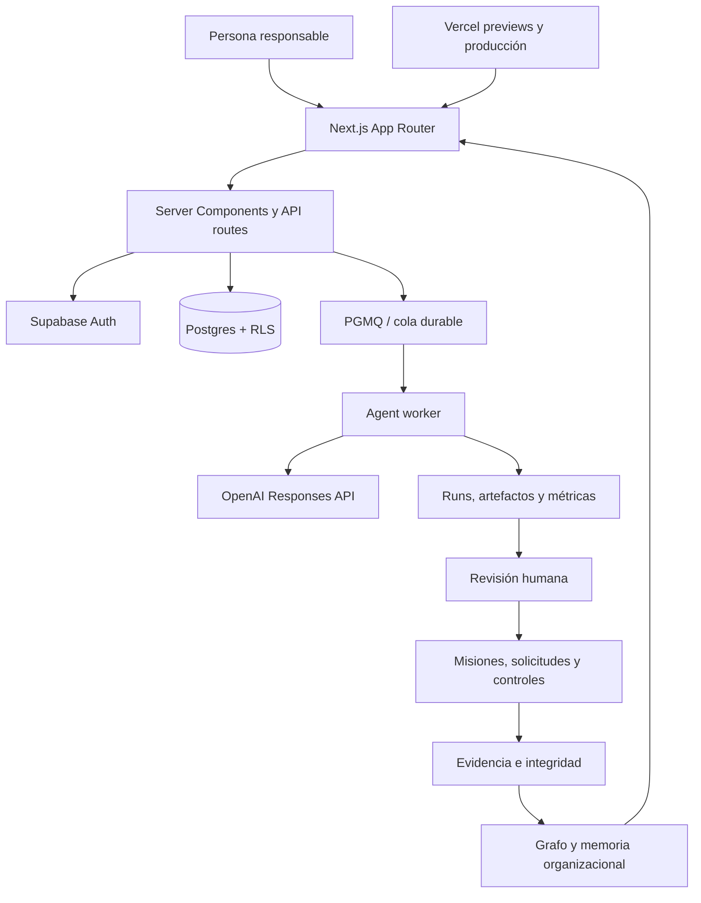

<p align="center">
  <strong>KUMPLIO</strong>
</p>

<h1 align="center">Del problema de cumplimiento a la evidencia defendible.</h1>

<p align="center">
  Sistema operativo de cumplimiento para Chile: centraliza información sensible, coordina especialistas, convierte análisis en trabajo y deja cada decisión trazable.
</p>

<p align="center">
  <a href="https://www.kumplio.app"><strong>Ver Kumplio</strong></a>
  ·
  <a href="./ROADMAP.md">Roadmap canónico</a>
  ·
  <a href="./docs/assurance/ui-golden-path-production-3x-2026-08-07.md">Assurance UI 3/3</a>
  ·
  <a href="./docs/assurance/n3uralia-processing-inventory-3x-2026-08-08.md">Inventario real 3/3</a>
  ·
  <a href="./docs/assurance/n3uralia-processing-lifecycle-3x-2026-08-08.md">Lifecycle 3/3</a>
</p>

---

## Resumen ejecutivo

Kumplio no es un chatbot jurídico ni un repositorio de documentos. Es una plataforma **Chile-first** que transforma una situación de cumplimiento en un expediente vivo y conecta:

```text
situación
→ fuentes y evidencia
→ especialistas
→ revisión humana
→ plan operativo
→ misión, responsable y plazo
→ controles y solicitudes de evidencia
→ confianza explicable
→ memoria organizacional
```

La promesa central es:

> **Protege tus datos. Entiende qué hacer. Avanza con una guía clara.**

### Estado real al 8 de agosto de 2026

| Área | Estado comprobado |
|---|---|
| Baseline estable en `main` | `9b2ef72d9e1128671111b8e1cfec0612e4e04890` |
| Desarrollo técnico | sólido |
| Demo comercial acompañada | apta |
| Golden Path productivo | `VALIDATED x3` con actor E2E |
| Multiempresa y aislamiento interno | `VALIDATED` |
| Inventario real de N3uralia | 3 actividades revisadas |
| Revisión jurídica y lifecycle | 3/3 con `changes_requested` |
| Aviso y eliminación | `ACTIVE` en PR #236; no desplegado todavía |
| Piloto externo con personas | pendiente |
| Beta privada autoservicio | no habilitar todavía |
| Registro público autoservicio | no habilitado |

`VALIDATED` internamente no significa certificación, cumplimiento integral ni piloto externo.

---

## Qué existe y está probado

### 1. Workspace seguro y multiempresa — `VALIDATED INTERNO`

- autenticación y confirmación de cuenta;
- onboarding guiado;
- workspace activo explícito;
- organizaciones, miembros, roles, invitaciones y revocación;
- operaciones tenant-scoped;
- aislamiento positivo y negativo mediante RLS, RPC y pruebas de frontera;
- mutaciones privilegiadas limitadas al servidor;
- auditoría de cambios sensibles.

La deuda externa conocida más importante sigue siendo **Supabase Auth Leaked Password Protection desactivada**.

### 2. Expedientes de cumplimiento — `VALIDATED x3`

- situación inicial, contexto, prioridad, owner y estado;
- timeline de eventos;
- documentos, fuentes, controles y evidencia;
- relaciones navegables;
- flujo guiado desde el problema hasta el cierre operacional;
- cierre conservador cuando faltan antecedentes.

### 3. Consejo de Especialistas — `VALIDATED x3`

| Especialista | Función |
|---|---|
| **Isidora** | obligaciones, fuentes y evidencia documental |
| **Beatriz** | cambios regulatorios y vigencia |
| **Rodrigo** | riesgo, urgencia, escenarios e incertidumbre |
| **Verónica** | controles, evidencia, hallazgos y readiness |
| **Javier** | planes, dependencias, responsables y criterios de cierre |
| **Andrés** | desempeño, recurrencias y aprendizaje |
| **Julieta** | revisión jurídica, calidad, consistencia y comunicación |

Los especialistas usan salidas estructuradas, herramientas autorizadas y fronteras `DECIDE / NO DECIDE`. Una persona aprueba o solicita cambios; generar una salida no equivale a aprobarla.

### 4. Ejecución durable — `VALIDATED x3`

- cola PGMQ;
- enqueue idempotente;
- lease y heartbeat;
- retry controlado;
- recuperación de ejecuciones detenidas;
- dead-letter visible;
- procesamiento desacoplado de la solicitud web;
- runs, artefactos, herramientas, errores, modelos, tokens y tiempos persistidos.

### 5. Plan operativo, misiones y responsabilidad — `VALIDATED x3`

- expediente → plan operativo;
- misión con owner, prioridad y vencimiento;
- solicitudes de evidencia;
- delegación asistida;
- SLA, carga, bloqueos y escalamiento;
- briefing y continuidad diaria;
- idempotencia para impedir duplicados.

### 6. Controles, evidencia y assurance — `VALIDATED x3`

- controles conectados con obligaciones, casos y evidencia;
- procedencia, período, vigencia y confidencialidad;
- integridad mediante SHA-256;
- suficiencia revisada;
- diseño y operación evaluados por separado;
- baseline con unknowns explícitos;
- confianza limitada cuando la operación es parcial.

### 7. Inventario real de actividades de tratamiento — `VALIDATED INICIAL / ACTIVE`

N3uralia tiene tres actividades reales observadas:

1. **Gestión de contactos comerciales y solicitudes de demostración**.
2. **Gestión de cuentas, autenticación y acceso al workspace**.
3. **Gestión de expedientes y análisis asistido por especialistas IA**.

Cada actividad contiene:

- propósito y base expresamente propuesta;
- owner;
- titulares y categorías de datos;
- dataset;
- sistema o repositorio;
- proveedor o tercero;
- transferencia y retención declaradas;
- fuente verificable;
- revisión humana `approved / partial`;
- evidencia `accepted · verified`;
- snapshot SHA-256;
- unknowns visibles.

La cantidad mínima ya está cubierta. La calidad jurídica y operacional continúa abierta.

### 8. Revisión jurídica y de ciclo de vida — `VALIDATED INICIAL / CAMBIOS REQUERIDOS`

Kumplio separa cinco decisiones que antes podían confundirse dentro del inventario:

```text
base jurídica
retención
 destinatarios
subencargados
transferencias internacionales
```

Resultado productivo de las tres actividades:

| Actividad | Decisión | Base | Retención | Destinatarios | Subencargados | Transferencias | Unknowns |
|---|---|---|---|---|---|---|---:|
| Contactos comerciales y demos | `changes_requested` | `pending_evidence` | `needs_changes` | `pending_evidence` | `pending_evidence` | `pending_evidence` | 8 |
| Cuentas, autenticación y workspace | `changes_requested` | `pending_evidence` | `needs_changes` | `pending_evidence` | `pending_evidence` | `pending_evidence` | 8 |
| Expedientes y especialistas IA | `changes_requested` | `pending_evidence` | `needs_changes` | `pending_evidence` | `pending_evidence` | `pending_evidence` | 8 |

Cada revisión tiene versión, fuentes, evidencia, hash, unknowns y supersesión. Ninguna dimensión pendiente puede presentarse como aprobada.

### 9. Escritorio, Insights, grafo e impacto — `DEPLOYED / VALIDATED INICIAL`

- prioridades y explicación “¿Por qué aparece esto?”;
- briefing de las últimas 24 horas;
- trabajo asignado, delegado y bloqueado;
- confianza por dimensiones;
- grafo de casos, controles, evidencia, activos y decisiones;
- análisis de impacto;
- reutilización de controles y evidencia.

### 10. Motor regulatorio Chile — `DEPLOYED`

- BCN y LeyChile;
- Diario Oficial;
- Dirección del Trabajo;
- SMA y SNIFA;
- capturas controladas;
- versiones, hashes y comparación de cambios;
- claims con citas;
- separación entre publicación, vigencia, aplicabilidad y revisión.

### 11. Memoria organizacional — `DEPLOYED / SIN APRENDIZAJES REALES`

La infraestructura de nodos, relaciones, versiones, vigencia y supersesión existe. Todavía falta capturar, aprobar y reutilizar el primer aprendizaje real antes de considerarla una ventaja medida.

### 12. Release y assurance — `DONE EN SU ALCANCE TÉCNICO`

- `npm ci` reproducible;
- typecheck, build y smoke;
- Release Gate único;
- guardrails de producto, seguridad y roadmap;
- previews antes de merge;
- UI Golden Path productivo;
- aserciones server-side independientes;
- assurance multiempresa;
- procedimiento documentado para datos E2E.

---

## Evidencia productiva

### Golden Path por UI — 3/3

| Métrica | Resultado |
|---|---:|
| Ejecuciones Playwright | 3/3 |
| Aserciones persistidas | 51/51 |
| Etapas aprobadas | 15/15 |
| Jobs exitosos | 15/15 |
| Intentos por job | 1 |
| Retry / recovery / dead-letter | 0 / 0 / 0 |
| Tokens observados | 185.091 |

El recorrido incluyó login, onboarding, expediente, cinco especialistas, cinco revisiones explícitas, plan, misión, evidencia, baseline e inventario de tratamiento.

### Assurance disponibles

- [`UI Golden Path productivo 3/3`](./docs/assurance/ui-golden-path-production-3x-2026-08-07.md)
- [`Inventario real de N3uralia 3/3`](./docs/assurance/n3uralia-processing-inventory-3x-2026-08-08.md)
- [`Revisión lifecycle de N3uralia 3/3`](./docs/assurance/n3uralia-processing-lifecycle-3x-2026-08-08.md)
- [`Ciclo de vida de datos E2E`](./docs/operations/ui-golden-path-data-lifecycle.md)

> Esta evidencia demuestra arquitectura, persistencia, seguridad e idempotencia dentro del alcance probado. No sustituye revisión legal, auditoría, certificación ni observación de una organización externa.

---

## En desarrollo ahora

### Bloque 16, tarea 3 — aviso de privacidad y eliminación — `ACTIVE`

La PR **#236** implementa, pero todavía no acredita como desplegado:

- snapshot versionado del aviso público;
- una evidencia general compartida con SHA-256;
- vínculo del aviso con cada actividad;
- misión por actividad con owner y vencimiento;
- solicitud de mapeo del aviso a 14 días;
- solicitud de prueba de eliminación a 30 días;
- cierre de misión a 35 días;
- criterios auditables de eliminación: timestamp, proveedor, activo o dataset, alcance, responsable, resultado, `backup_purga_programada` y `backup_purga_confirmada`;
- estado visible en Digital Twin.

El aviso general no se considera prueba de cobertura específica y no se inventa evidencia de eliminación. La tarea seguirá `ACTIVE` hasta que CI, migraciones, verificación productiva, idempotencia y pruebas cross-tenant estén verdes.

---

## Gates antes de beta privada autoservicio

| Gate | Estado |
|---|---|
| Leaked Password Protection | `BLOCKED` por configuración externa |
| Tres actividades reales | `VALIDATED` |
| Lifecycle de cinco dimensiones | `VALIDATED INICIAL / CAMBIOS REQUERIDOS` |
| Aviso y eliminación | `ACTIVE` |
| Multiempresa interno | `VALIDATED` |
| Golden Path repetible | `VALIDATED x3` |
| Organización externa observada | pendiente |
| Tiempo humano, retrabajo y costo real | pendiente |

No se habilitará beta autoservicio mientras permanezcan abiertos los gates críticos de seguridad, lifecycle y validación externa.

---

## Arquitectura



### Stack principal

- **Frontend y backend:** Next.js App Router, React y TypeScript.
- **Datos y seguridad:** Supabase Auth, Postgres, RLS y RPC transaccionales.
- **IA:** OpenAI Responses API con Structured Outputs y control de calidad.
- **Orquestación:** workflows por etapas, PGMQ, lease, heartbeat y cron.
- **Interfaz:** Tailwind CSS y componentes reutilizables accesibles.
- **Despliegue:** Vercel con previews y gates antes de merge.

---

## Mapa del repositorio

```text
app/                         rutas públicas, autenticadas y API
components/                  experiencia y componentes reutilizables
lib/agents/                  catálogo, prompts, schemas y runtime
lib/compliance/              expedientes, controles, evidencia y confianza
lib/privacy/                 contrato versionado del aviso público
lib/supabase/                clientes de navegador, servidor y administración
supabase/migrations/         esquema y cambios reproducibles
scripts/                     guardrails, verificaciones y smoke tests
tests/e2e/                   Golden Path productivo
.github/workflows/           CI, release y assurance
ROADMAP.md                   fuente canónica de prioridad y estado
docs/assurance/              evidencia técnica de recorridos validados
docs/governance/             contrato de ejecución y cambio de prioridades
docs/operations/             procedimientos operacionales y de datos
```

---

## Roadmap canónico: trabajar sin desviaciones

[`ROADMAP.md`](./ROADMAP.md) es la **única fuente canónica de prioridad, secuencia y estado**.

Un cambio está autorizado cuando cumple al menos una condición:

1. pertenece al único bloque marcado `NEXT`;
2. cierra un gate `P0` o una tarea `ACTIVE`;
3. corrige un bug, una regresión, un riesgo de seguridad o integridad;
4. responde a una decisión explícita del owner que actualiza el roadmap en la misma PR.

No se inicia trabajo `PLANNED` o `DEFERRED` solo porque parezca atractivo. El contrato completo está en [`docs/governance/canonical-roadmap-contract.md`](./docs/governance/canonical-roadmap-contract.md) y se verifica mediante:

```bash
npm run check:canonical-roadmap
```

Cuando una PR cambia alcance, prioridad o estado, debe actualizar `ROADMAP.md` dentro de la misma PR.

---

## Desarrollo local

### Requisitos

- Node.js compatible con Next.js 16;
- npm y el lockfile comprometido;
- proyecto Supabase;
- credenciales de OpenAI para ejecutar especialistas;
- secretos gestionados exclusivamente en servidor.

### Variables mínimas

```bash
NEXT_PUBLIC_SUPABASE_URL=
NEXT_PUBLIC_SUPABASE_PUBLISHABLE_KEY=

# Solo servidor
SUPABASE_URL=
SUPABASE_SECRET_KEY=
OPENAI_API_KEY=

# Opcionales
OPENAI_REASONING_MODEL=
OPENAI_FALLBACK_MODEL=
```

También se aceptan las claves legacy `NEXT_PUBLIC_SUPABASE_ANON_KEY` y `SUPABASE_SERVICE_ROLE_KEY`, pero nunca deben exponerse secretos en componentes cliente, logs, documentación o artefactos.

### Instalación

```bash
npm ci
npm run dev
```

Abrir `http://localhost:3000`.

### Validación antes de publicar

```bash
npm run typecheck
npm run check:canonical-roadmap
npm run release:check
npm run smoke
```

`release:check` ejecuta contratos de seguridad, producto, orquestación, evidencia, inventario, tenant assurance y build de producción.

---

## Flujo de contribución

1. Leer [`ROADMAP.md`](./ROADMAP.md), este README y [`AGENTS.md`](./AGENTS.md).
2. Identificar el bloque, gate o defecto autorizado.
3. Crear una rama desde `main`.
4. Implementar el cambio más pequeño, reversible y verificable.
5. Ejecutar las validaciones relevantes.
6. Abrir una PR con alineación explícita al roadmap.
7. Esperar gates y previews verdes.
8. Fusionar solo cuando la evidencia sostenga el estado declarado.

---

## Límites y no-promesas

Kumplio no debe afirmar:

- cumplimiento global por un score alto;
- aplicabilidad jurídica sin fuente y validación;
- operación efectiva por un documento aislado;
- inventario completo mientras existan unknowns relevantes;
- eliminación demostrada sin una prueba auditable;
- auditoría aprobada por una salida generada;
- reemplazo de abogado, auditor, DPO o autoridad;
- éxito comercial basándose en tenants sintéticos;
- ausencia de defectos fuera del recorrido probado.

La plataforma guía, organiza y demuestra. La decisión sensible permanece en manos de una persona responsable.

---

## La visión

Kumplio busca convertirse en el lugar donde una organización puede responder, sin reconstruir todo desde cero:

```text
¿Qué cambió?
¿Qué riesgo tengo?
¿Qué debo decidir?
¿Qué falta demostrar?
¿Quién debe actuar?
¿Por qué Kumplio llegó a esta conclusión?
¿Qué aprendimos para no repetir el problema?
```

Ese es el producto: **un sistema operativo que coordina cumplimiento, personas, especialistas, evidencia y aprendizaje continuo**.
