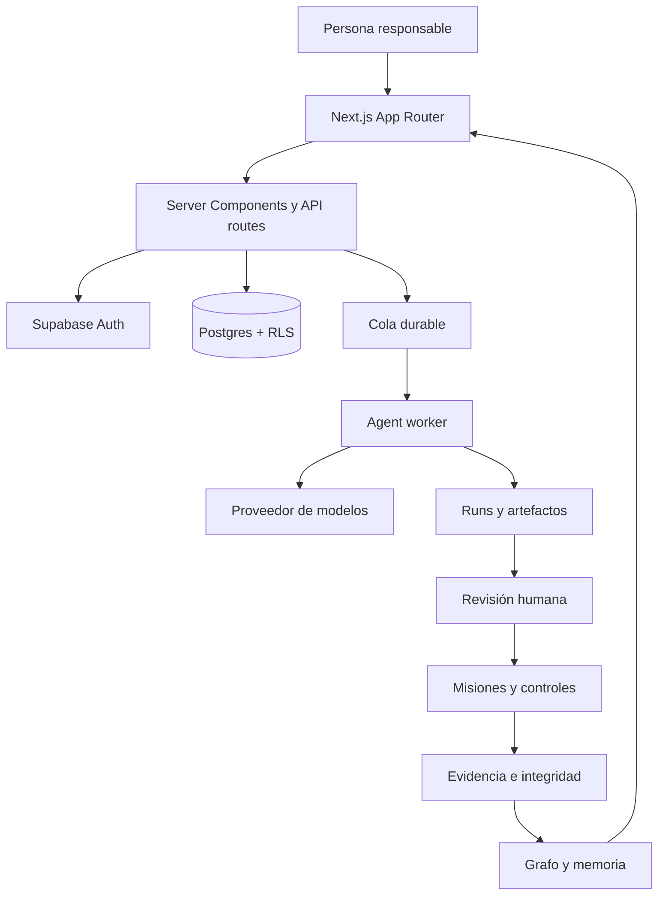

<p align="center">
  <strong>KUMPLIO</strong>
</p>

<h1 align="center">Del problema de cumplimiento a la evidencia defendible.</h1>

<p align="center">
  Sistema operativo de cumplimiento para Chile: centraliza información sensible, coordina especialistas, convierte análisis en trabajo y deja cada decisión trazable.
</p>

<p align="center">
  <a href="https://www.kumplio.app"><strong>Ver Kumplio</strong></a>
  ·
  <a href="./ROADMAP.md">Roadmap canónico</a>
  ·
  <a href="./docs/assurance/ui-golden-path-production-3x-2026-08-07.md">UI 3/3</a>
  ·
  <a href="./docs/assurance/n3uralia-processing-inventory-3x-2026-08-08.md">Inventario 3/3</a>
  ·
  <a href="./docs/assurance/n3uralia-primary-deletion-3x-2026-08-08.md">Eliminación primaria 3/3</a>
</p>

---

## Qué es Kumplio

Kumplio no es un chatbot jurídico ni una colección de checklists. Es una plataforma **Chile-first** que convierte una situación de cumplimiento en un expediente vivo:

```text
situación
→ fuentes y evidencia
→ especialistas
→ revisión humana
→ plan operativo
→ responsables y plazos
→ controles y solicitudes de evidencia
→ trazabilidad y aprendizaje
```

La promesa central es:

> **Protege tus datos. Entiende qué hacer. Avanza con una guía clara.**

---

## Estado actual — 9 de agosto de 2026

| Capa | Estado comprobado |
|---|---:|
| Golden Path productivo | `VALIDATED x3` |
| Multiempresa interno | `VALIDATED` |
| Actividades reales de tratamiento | 3/3 |
| Lifecycle | `changes_requested` 3/3 |
| Mapeo del aviso | `accepted_with_gaps` 3/3 |
| Mecanismo controlado de eliminación | 3/3 |
| Eliminación primaria operativa | 3/3 |
| Assurance de proveedor | 3/3 |
| Solicitudes tenant-specific | 3/3 |
| Configuración tenant proveedor | 0/3 |
| Eliminación operacional final | 0/3 |
| Piloto externo | pendiente |
| Beta privada autoservicio | no habilitar todavía |

`VALIDATED` internamente no significa certificación, cumplimiento integral ni piloto externo. Una política pública, un mapeo aceptado o una prueba controlada **no equivalen por sí solos a cierre operacional final**.

---

## Qué hace único a Kumplio

1. **Centraliza primero.** La información sensible vive en un expediente controlado.
2. **Separa hechos de conclusiones.** Fuentes, inferencias, reservas, unknowns y decisiones humanas no se mezclan.
3. **Convierte análisis en operación.** Cada gap puede terminar en misión, owner, vencimiento y solicitud de evidencia.
4. **Exige evidencia defendible.** Un documento no acredita por sí solo un control, un aviso ni una eliminación.
5. **Mantiene supervisión humana.** Los especialistas proponen; una persona aprueba, rechaza o solicita cambios.
6. **Versiona antes de sobrescribir.** Cada revisión conserva procedencia, hash, vigencia y supersesión.
7. **Explica la confianza.** Los resultados declaran alcance y límites.
8. **Aprende sin inventar.** Sólo el conocimiento aprobado puede convertirse en precedente reutilizable.

---

## Capacidades validadas

### Workspace y multiempresa

- autenticación y onboarding;
- organizaciones, miembros y roles;
- aislamiento tenant-scoped;
- auditoría de cambios sensibles.

### Expedientes

- situación, contexto, prioridad, owner y estado;
- timeline de eventos;
- documentos, fuentes, controles y evidencia;
- navegación guiada desde el problema hasta el trabajo operacional.

### Consejo de Especialistas

| Especialista | Función |
|---|---|
| **Isidora** | obligaciones, fuentes y evidencia |
| **Beatriz** | cambios regulatorios y vigencia |
| **Rodrigo** | riesgo, urgencia e incertidumbre |
| **Verónica** | controles, evidencia y readiness |
| **Javier** | planes, dependencias y criterios de cierre |
| **Andrés** | desempeño y aprendizaje |
| **Julieta** | revisión jurídica, calidad y consistencia |

### Ejecución durable

- cola durable;
- procesamiento por etapas;
- retry y recovery controlados;
- runs, artefactos, métricas y errores persistidos.

### Plan operativo

- expediente → plan operativo;
- misión, owner, prioridad y vencimiento;
- solicitudes de evidencia;
- SLA, delegación, bloqueos y seguimiento.

### Controles y evidencia

- procedencia y vigencia;
- integridad SHA-256;
- suficiencia revisada;
- diseño y operación separados;
- unknowns explícitos.

---

## Bloque 16 — evidencia real y privacidad

Kumplio mantiene tres actividades reales de tratamiento observadas y revisadas. El estado actual de la cadena de evidencia es:

```text
mapeo del aviso                    3/3
mecanismo controlado               3/3
eliminación primaria               3/3
assurance proveedor                3/3
requests tenant-specific           3/3
configuración tenant               0/3
eliminación operacional final      0/3
```

### Qué ya está demostrado

- 3/3 mapeos aceptados con brechas;
- 3/3 mecanismos controlados;
- 3/3 ejercicios de eliminación primaria sobre stores productivos con registros sintéticos;
- 3/3 evidencias de assurance de proveedor;
- 3/3 solicitudes tenant-specific abiertas con owner y vencimiento;
- trazabilidad adicional de runtime desplegada y validada.

### Qué falta

1. verificar configuración efectiva de backups/PITR del tenant de base de datos;
2. verificar configuración efectiva de retención del proveedor de modelos;
3. promover configuración tenant sólo cuando exista evidencia suficiente;
4. ejecutar y revisar la eliminación operacional final;
5. resolver base jurídica, retención, destinatarios, subencargados y transferencias;
6. cerrar Leaked Password Protection antes de beta autoservicio.

No corresponde avanzar al Bloque 17 mientras estos gates permanezcan abiertos.

---

## Evidencia productiva

- [`UI Golden Path productivo 3/3`](./docs/assurance/ui-golden-path-production-3x-2026-08-07.md)
- [`Inventario real de N3uralia 3/3`](./docs/assurance/n3uralia-processing-inventory-3x-2026-08-08.md)
- [`Revisión lifecycle 3/3`](./docs/assurance/n3uralia-processing-lifecycle-3x-2026-08-08.md)
- [`Aviso y acciones 3/3`](./docs/assurance/n3uralia-processing-privacy-remediation-3x-2026-08-08.md)
- [`Mapeo del aviso 3/3`](./docs/assurance/n3uralia-processing-notice-mapping-3x-2026-08-08.md)
- [`Eliminación primaria 3/3`](./docs/assurance/n3uralia-primary-deletion-3x-2026-08-08.md)
- [`Assurance de proveedor 3/3`](./docs/assurance/n3uralia-provider-retention-assurance-3x-2026-08-08.md)
- [`Requests tenant-specific 3/3`](./docs/assurance/n3uralia-provider-configuration-requests-3x-2026-08-08.md)

> La evidencia demuestra arquitectura, persistencia, seguridad e idempotencia dentro del alcance probado. No sustituye revisión legal, auditoría, certificación ni observación de una organización externa.

---

## Arquitectura



### Stack

- **Frontend y backend:** Next.js App Router, React y TypeScript.
- **Datos:** Supabase Auth y Postgres.
- **IA:** Responses API con salidas estructuradas.
- **Orquestación:** workflows por etapas y cola durable.
- **Despliegue:** Vercel con previews y gates antes de merge.

---

## Mapa del repositorio

```text
app/                         rutas y API
components/                  experiencia y componentes
lib/agents/                  especialistas y runtime
lib/compliance/              expedientes, controles y evidencia
lib/privacy/                 contratos de privacidad
lib/supabase/                acceso a datos
supabase/migrations/         esquema versionado
scripts/                     guardrails y verificaciones
tests/e2e/                   Golden Path
.github/workflows/           CI y release
ROADMAP.md                   prioridad y estado canónicos
docs/assurance/              evidencia técnica
docs/governance/             reglas de ejecución
docs/operations/             procedimientos operacionales
```

---

## Roadmap canónico: trabajar sin desviaciones

[`ROADMAP.md`](./ROADMAP.md) es la **única fuente canónica de prioridad, secuencia y estado**.

Un cambio está autorizado cuando cumple al menos una condición:

1. pertenece al único bloque marcado `NEXT`;
2. cierra un gate `P0` o una tarea `ACTIVE`;
3. corrige un bug, regresión o riesgo de seguridad e integridad;
4. responde a una decisión explícita del owner que actualiza el roadmap en la misma PR.

No se inicia trabajo `PLANNED` o `DEFERRED` solo porque parezca atractivo. El contrato está en [`docs/governance/canonical-roadmap-contract.md`](./docs/governance/canonical-roadmap-contract.md) y se verifica mediante:

```bash
npm run check:canonical-roadmap
```

---

## Desarrollo local

```bash
npm ci
npm run dev
```

Validación principal:

```bash
npm run typecheck
npm run check:canonical-roadmap
npm run release:check
npm run smoke
```

---

## Flujo de contribución

1. Leer [`ROADMAP.md`](./ROADMAP.md), este README y [`AGENTS.md`](./AGENTS.md).
2. Identificar el bloque, gate o defecto autorizado.
3. Crear una rama desde `main`.
4. Implementar el cambio más pequeño, reversible y verificable.
5. Ejecutar las validaciones relevantes.
6. Abrir una PR con alineación explícita al roadmap.
7. Esperar gates y previews verdes.
8. Fusionar sólo cuando la evidencia sostenga el estado declarado.

---

## Límites y no-promesas

Kumplio no debe afirmar:

- cumplimiento global por un score alto;
- aplicabilidad jurídica sin fuente y validación;
- operación efectiva por un documento aislado;
- inventario completo mientras existan unknowns relevantes;
- aviso suficiente porque un mapeo fue aceptado;
- eliminación final demostrada por una prueba primaria sintética;
- purga de backups por conocer una política pública;
- configuración tenant verificada sin evidencia suficiente;
- reemplazo de abogado, auditor, DPO o autoridad;
- éxito comercial basándose en tenants sintéticos.

La plataforma guía, organiza y demuestra. La decisión sensible permanece en manos de una persona responsable.

---

## La visión

```text
¿Qué cambió?
¿Qué riesgo tengo?
¿Qué debo decidir?
¿Qué falta demostrar?
¿Quién debe actuar?
¿Por qué Kumplio llegó a esta conclusión?
¿Qué aprendimos para no repetir el problema?
```

Ese es el producto: **un sistema operativo que coordina cumplimiento, personas, especialistas, evidencia y aprendizaje continuo**.
