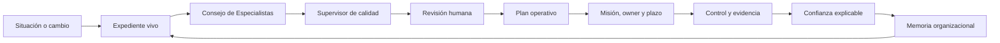
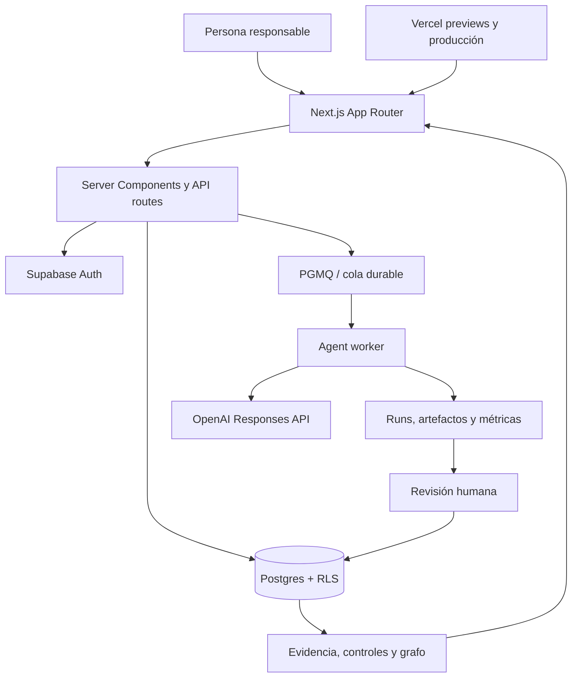

<p align="center">
  <strong>KUMPLIO</strong>
</p>

<h1 align="center">Del problema de cumplimiento a la evidencia defendible.</h1>

<p align="center">
  Sistema operativo de cumplimiento para centralizar información sensible, coordinar especialistas, convertir análisis en trabajo y demostrar qué hizo una organización.
</p>

<p align="center">
  <a href="https://www.kumplio.app"><strong>Ver Kumplio</strong></a>
  ·
  <a href="./ROADMAP.md">Roadmap canónico</a>
  ·
  <a href="./docs/assurance/ui-golden-path-production-3x-2026-08-07.md">Assurance productivo 3/3</a>
  ·
  <a href="./docs/governance/canonical-roadmap-contract.md">Contrato de ejecución</a>
</p>

---

## Qué es Kumplio

Kumplio no es un chatbot jurídico, un repositorio de documentos ni una colección de checklists. Es una plataforma **Chile-first** que transforma una situación de cumplimiento en un expediente vivo, coordina análisis especializados, exige revisión humana y deja controles, responsables, plazos y evidencia trazable.

Su promesa central es simple:

> **Protege tus datos. Entiende qué hacer. Avanza con una guía clara.**

El producto está diseñado para que la organización no tenga que reconstruir su historia cada vez que aparece una auditoría, una nueva exigencia, un incidente o una decisión compleja.

## El ciclo operativo



La diferencia no está en generar más texto. Está en **cerrar el ciclo completo**:

```text
entender
→ contrastar
→ decidir
→ asignar
→ ejecutar
→ demostrar
→ aprender
```

---

## Por qué Kumplio es diferente

| Enfoque habitual | Kumplio |
|---|---|
| Respuesta aislada | Expediente versionado y vivo |
| Documento almacenado | Evidencia con procedencia, vigencia e integridad |
| Recomendación genérica | Acción con responsable, plazo y criterio de cierre |
| IA presentada como autoridad | Especialistas con fronteras y revisión humana |
| Score decorativo | Confianza por dimensiones, alcance y límites |
| Checklist estático | Relación entre obligación, control, evidencia, caso y decisión |
| Trabajo disperso por correo | Seguimiento centralizado y auditable |
| Cada caso empieza desde cero | Precedentes, grafo y memoria organizacional |

### Ocho decisiones de diseño que forman la ventaja

1. **Trabajo antes que chat.** Cada análisis debe terminar en una decisión, una acción o una reserva explícita.
2. **Evidencia antes que afirmación.** Sin fuente no hay conclusión regulatoria; sin evidencia no hay conclusión de cumplimiento.
3. **La persona conserva la decisión.** Aprobar, publicar, cerrar, eliminar o escalar requiere autorización explícita.
4. **La incertidumbre es un dato.** Lo desconocido se conserva hasta resolverse; nunca se rellena para mejorar un score.
5. **La confianza tiene alcance.** Kumplio explica por qué existe un porcentaje y qué podría cambiarlo.
6. **La ejecución es durable.** Los especialistas trabajan mediante cola, lease, heartbeat, retry y dead-letter controlado.
7. **Cada organización permanece aislada.** El modelo multiempresa se prueba en ambos sentidos, no se asume.
8. **Cada caso debe mejorar el siguiente.** Correcciones, precedentes y aprendizajes aprobados forman memoria organizacional.

---

## Funcionalidades actuales

### 1. Workspace seguro y multiempresa — `VALIDATED`

- autenticación y confirmación de cuenta;
- onboarding guiado;
- workspace activo explícito;
- organizaciones, miembros, roles e invitaciones;
- aislamiento tenant-scoped mediante RLS, RPC y verificaciones negativas;
- operaciones privilegiadas limitadas al servidor;
- auditoría de cambios sensibles.

### 2. Expedientes de cumplimiento — `VALIDATED x3`

- creación de casos desde una situación real;
- contexto, prioridad, owner y estado;
- timeline de eventos;
- documentos, evidencia, controles y relaciones;
- flujo guiado sin exponer infraestructura interna;
- trazabilidad completa desde la situación hasta el cierre operacional.

### 3. Consejo de Especialistas — `VALIDATED x3`

Kumplio coordina especialistas con misiones y límites explícitos:

| Especialista | Función |
|---|---|
| **Isidora** | Obligaciones, fuentes y evidencia documental |
| **Beatriz** | Cambios regulatorios y vigencia |
| **Rodrigo** | Riesgo, urgencia, escenarios e incertidumbre |
| **Verónica** | Controles, evidencia, hallazgos y readiness |
| **Javier** | Planes, dependencias, responsables y criterios de cierre |
| **Andrés** | Desempeño, recurrencias y aprendizaje |
| **Julieta** | Revisión jurídica, calidad, consistencia y comunicación |

Cada salida usa contratos estructurados, fuentes autorizadas y un supervisor que puede bloquear resultados insuficientes antes de presentarlos.

### 4. Revisión humana obligatoria — `VALIDATED`

- aprobación o solicitud de cambios por etapa;
- justificación escrita;
- checklist de evidencia, supuestos y reservas;
- versiones nuevas sin sobrescribir resultados previos;
- separación entre **generado**, **revisado** y **aprobado**;
- cierre conservador cuando aún falta evidencia.

### 5. Ejecución durable de agentes — `VALIDATED x3`

- jobs tenant-scoped;
- enqueue idempotente;
- lease y heartbeat;
- reintentos controlados;
- recuperación de ejecuciones detenidas;
- dead-letter visible;
- procesamiento desacoplado de la solicitud web;
- consumo de tokens, tiempos y errores persistidos.

### 6. Plan operativo, misiones y responsabilidad — `VALIDATED x3`

- conversión de un expediente en plan operativo;
- misión con owner, prioridad y vencimiento;
- solicitud inicial de evidencia;
- asignación asistida según experiencia y carga;
- SLA, seguimiento y escalamiento visibles;
- briefing de trabajo y continuidad diaria;
- acciones idempotentes para evitar duplicados.

### 7. Controles, evidencia y aseguramiento — `VALIDATED x3`

- controles conectados con obligaciones y casos;
- evidencia con fuente, período, vigencia y confidencialidad;
- integridad mediante hash SHA-256;
- suficiencia revisada;
- evaluación de diseño y operación separadas;
- baseline assurance con desconocidos explícitos;
- confianza acotada cuando la operación es parcial.

### 8. Inventario de actividades de tratamiento — `VALIDATED INICIAL`

- actividad, propósito y base propuesta;
- titulares y categorías de datos;
- sistema o repositorio;
- dataset;
- tercero o proveedor;
- transferencia internacional y retención;
- fuente verificable;
- snapshot con hash;
- revisión humana;
- desconocidos abiertos visibles.

Una base propuesta nunca se muestra como conclusión jurídica y una actividad inicial nunca se presenta como inventario completo.

### 9. Escritorio operacional — `VALIDATED INICIAL`

- prioridades de hoy;
- asuntos críticos, decisiones y bloqueos;
- “¿Por qué aparece esto?” para cada prioridad;
- briefing de las últimas 24 horas;
- trabajo delegado y esperando respuesta;
- confianza del alcance registrado;
- siguiente acción recomendada.

### 10. Insights, grafo e impacto — `DEPLOYED`

- relaciones navegables entre casos, controles, evidencia y activos;
- análisis de impacto;
- reutilización de controles y evidencia;
- tendencias y señales operacionales;
- confianza por dimensiones;
- topes para evitar sobreafirmaciones.

### 11. Motor regulatorio Chile — `DEPLOYED`

- fuentes oficiales y versiones;
- claims con citas;
- BCN y LeyChile;
- Diario Oficial;
- Dirección del Trabajo;
- SMA y SNIFA;
- comparación de cambios;
- separación entre publicado, vigente, anticipado y pendiente de revisión.

### 12. Memoria organizacional — `DEPLOYED / EN POBLAMIENTO`

- casos similares;
- precedentes en el contexto de los especialistas;
- infraestructura de nodos, relaciones y versiones;
- vigencia y supersesión;
- preparación para reutilizar correcciones humanas aprobadas.

La infraestructura existe; los aprendizajes reales todavía deben poblarse y validarse antes de considerarla una ventaja medida.

### 13. Assurance y release — `DONE EN SU ALCANCE TÉCNICO`

- `npm ci` reproducible;
- typecheck, build y smoke;
- Release Gate único;
- validaciones de fronteras cliente-servidor;
- pruebas de seguridad e idempotencia;
- previews de Vercel antes del merge;
- UI Golden Path productivo;
- aserciones server-side independientes;
- ciclo de vida documentado para tenants E2E.

---

## Validación productiva comprobada

El Golden Path se ejecutó tres veces consecutivas contra producción, usando una identidad y organización independientes en cada intento.

| Métrica del assurance 3/3 | Resultado |
|---|---:|
| Ejecuciones Playwright exitosas | 3/3 |
| Aserciones persistidas | 51/51 |
| Etapas aprobadas | 15/15 |
| Jobs exitosos | 15/15 |
| Intentos por job | 1 |
| Retry | 0 |
| Recovery manual | 0 |
| Dead-letter | 0 |
| Tokens totales observados | 185.091 |

El recorrido incluyó login, onboarding, expediente, cinco especialistas, cinco revisiones, plan, misión, evidencia, baseline e inventario de tratamiento.

> Esta evidencia demuestra repetibilidad técnica interna. No equivale a un piloto externo, una certificación ni una conclusión de cumplimiento legal.

El detalle se conserva en [`docs/assurance/ui-golden-path-production-3x-2026-08-07.md`](./docs/assurance/ui-golden-path-production-3x-2026-08-07.md).

---

## Arquitectura



### Stack principal

- **Frontend y backend:** Next.js App Router, React, TypeScript.
- **Datos y seguridad:** Supabase Auth, Postgres, RLS y RPC transaccionales.
- **IA:** OpenAI Responses API con salidas estructuradas y control de calidad.
- **Orquestación:** workflows por etapas, jobs durables y cron de worker.
- **Interfaz:** Tailwind CSS y componentes accesibles reutilizables.
- **Despliegue:** Vercel con previews y validación antes de merge.

---

## Mapa del repositorio

```text
app/                         rutas públicas, autenticadas y API
components/                  experiencia y componentes reutilizables
lib/agents/                  catálogo, prompts, schemas y runtime
lib/compliance/              expedientes, controles, evidencia y confianza
lib/supabase/                clientes de navegador, servidor y administración
supabase/migrations/         esquema y cambios reproducibles
scripts/                     guardrails, verificaciones y smoke tests
tests/e2e/                   Golden Path productivo
.github/workflows/           CI, release y assurance
ROADMAP.md                   fuente canónica de prioridad y estado
docs/assurance/              evidencia técnica de recorridos validados
docs/governance/             contrato de ejecución y cambio de prioridades
```

---

## Roadmap canónico: trabajar sin desviaciones

[`ROADMAP.md`](./ROADMAP.md) es la **única fuente canónica de prioridad, secuencia y estado**.

Un cambio está autorizado cuando cumple al menos una condición:

1. pertenece al único bloque marcado `NEXT`;
2. cierra un gate `P0` o una tarea `ACTIVE`;
3. corrige un bug, una regresión, un riesgo de seguridad o integridad;
4. responde a una decisión explícita del owner que actualiza el roadmap en la misma PR.

No se debe iniciar trabajo de bloques `PLANNED`, `DEFERRED` o ideas nuevas solo porque parezcan atractivas. Una conversación, issue o PR no cambia la prioridad por sí sola.

El contrato completo está en [`docs/governance/canonical-roadmap-contract.md`](./docs/governance/canonical-roadmap-contract.md) y se valida automáticamente mediante:

```bash
npm run check:canonical-roadmap
```

Cuando una PR cambia alcance, prioridad o estado, debe actualizar `ROADMAP.md` dentro de la misma PR.

---

## Desarrollo local

### Requisitos

- Node.js compatible con Next.js 16;
- npm y el lockfile comprometido;
- proyecto Supabase;
- credenciales de OpenAI para ejecutar especialistas;
- variables de servidor gestionadas fuera del cliente.

### Variables mínimas

```bash
NEXT_PUBLIC_SUPABASE_URL=
NEXT_PUBLIC_SUPABASE_PUBLISHABLE_KEY=

# Solo servidor
SUPABASE_URL=
SUPABASE_SECRET_KEY=
OPENAI_API_KEY=

# Opcionales
OPENAI_REASONING_MODEL=
OPENAI_FALLBACK_MODEL=
```

También se aceptan las claves legacy `NEXT_PUBLIC_SUPABASE_ANON_KEY` y `SUPABASE_SERVICE_ROLE_KEY`, pero nunca deben exponerse secretos en componentes cliente, logs, documentación o artefactos.

### Instalación

```bash
npm ci
npm run dev
```

Abrir `http://localhost:3000`.

### Validación antes de publicar

```bash
npm run typecheck
npm run check:canonical-roadmap
npm run release:check
npm run smoke
```

`release:check` ejecuta los contratos de seguridad, producto, orquestación, evidencia, tenant assurance y build de producción.

---

## Flujo de contribución

1. Leer [`ROADMAP.md`](./ROADMAP.md), este README y [`AGENTS.md`](./AGENTS.md).
2. Identificar el bloque, gate o defecto autorizado.
3. Crear una rama desde `main`.
4. Implementar el cambio más pequeño, reversible y verificable.
5. Ejecutar las validaciones relevantes.
6. Abrir una PR con alineación explícita al roadmap.
7. Esperar Release Gate y previews verdes.
8. Fusionar solo cuando la evidencia sostenga el estado declarado.

La plantilla de PR obliga a declarar la alineación con el roadmap y evita cambiar prioridades silenciosamente.

---

## Límites y no-promesas

Kumplio no debe afirmar:

- cumplimiento global por un score alto;
- aplicabilidad jurídica sin fuente y validación;
- operación efectiva por un documento aislado;
- inventario completo cuando existen desconocidos;
- auditoría aprobada por una salida generada;
- reemplazo de abogado, auditor, DPO o autoridad;
- éxito comercial basándose en tenants sintéticos;
- ausencia de defectos fuera del recorrido probado.

La plataforma guía, organiza y demuestra. La decisión sensible permanece en manos de una persona responsable.

---

## Prioridad vigente

La prioridad no se redefine en este README. Siempre se toma desde la sección **“Próximos bloques de 3”** y la **“Decisión vigente”** de [`ROADMAP.md`](./ROADMAP.md).

En el cierre actual, la ruta de valor se concentra en:

- ampliar el inventario con actividades reales;
- resolver gates de seguridad pendientes;
- poblar aprendizaje organizacional aprobado;
- ejecutar un piloto externo supervisado;
- medir tiempo, retrabajo, confianza y costo real.

No se agregan módulos nuevos si compiten con esos gates.

---

## La visión

Kumplio busca convertirse en el lugar donde una organización puede responder, sin reconstruir todo desde cero:

```text
¿Qué cambió?
¿Qué riesgo tengo?
¿Qué debo decidir?
¿Qué falta demostrar?
¿Quién debe actuar?
¿Por qué Kumplio llegó a esta conclusión?
¿Qué aprendimos para no repetir el problema?
```

Ese es el producto: **un sistema operativo que coordina cumplimiento, personas, especialistas, evidencia y aprendizaje continuo**.