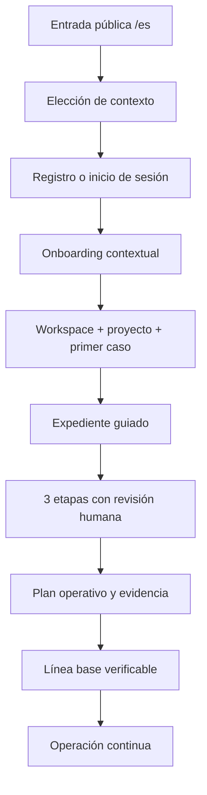

# Producto y recorridos

## Qué es Kumplio

Kumplio es una plataforma SaaS chilena de cumplimiento continuo. Convierte una necesidad expresada en lenguaje cotidiano en un expediente trazable, evidencia revisable, responsables, controles y siguientes acciones. La plataforma apoya el trabajo; no declara cumplimiento legal automático ni sustituye revisión profesional.

## Usuarios

- Personas que necesitan entender y ordenar el uso de sus datos.
- Profesionales que administran obligaciones y evidencia para clientes.
- Empresas que requieren operación multiusuario, responsables, controles y trazabilidad.
- Revisores humanos que aprueban, piden cambios o rechazan resultados de agentes.
- Operadores internos que supervisan colas, fuentes regulatorias y despliegues.

## Recorrido canónico de activación

### Contratos principales

1. La entrada pública conserva el contexto mediante `next`.
2. El onboarding inicializa de forma atómica organización, proyecto y primer caso.
3. El expediente usa una secuencia de tres etapas.
4. Cada etapa produce run, artefacto y revisión humana.
5. El workflow no avanza sin aprobación explícita.
6. El cierre crea o confirma misión, solicitud de evidencia y línea base.
7. La operación continúa en inicio, casos, alertas, actividad, evidencia y personas.

## Núcleo autenticado

La experiencia principal vive bajo `/app`:

| Superficie | Propósito |
|---|---|
| `/app/inicio` | Contexto, progreso y siguiente acción |
| `/app/casos` | Expedientes activos y cerrados |
| `/app/alertas` | Riesgos, vencimientos y eventos accionables |
| `/app/actividad` | Historial operativo y trazabilidad |
| `/app/evidencia` | Solicitudes, evidencia y estados de revisión |
| `/app/personas` | Equipo, responsables y acceso |
| `/app/documentos` | Documentos y progreso de procesamiento |
| `/app/configuracion` | Configuración del workspace |

El repositorio conserva superficies especializadas adicionales —digital twin, controles, regulatorio, agentes, misiones y analítica— que alimentan o amplían el mismo modelo.

## Modelo operacional

El objeto de trabajo central es el **expediente**. Un expediente conecta:

- organización y proyecto;
- situación o necesidad;
- workflow y etapas;
- runs de agentes;
- artefactos y fuentes;
- revisiones humanas;
- controles, evaluaciones y evidencia;
- misión, responsables y solicitudes;
- eventos de auditoría y memoria organizacional.

## Principios de producto

- Evidencia antes que apariencia de certeza.
- Revisión humana antes de avance o cierre.
- Lenguaje claro antes que jerga jurídica.
- Desconocidos explícitos antes que conclusiones inventadas.
- Aislamiento por organización en cada frontera.
- Recuperación e idempotencia antes que duplicación.
- La IA propone y estructura; la persona decide.
