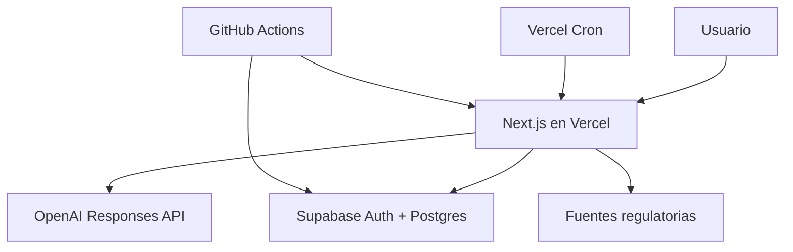

# Arquitectura técnica

## Stack

| Capa | Tecnología |
|---|---|
| Web | Next.js 16 App Router, React 19, TypeScript |
| UI | Tailwind CSS 4, shadcn, Base UI, Lucide |
| Backend web | Route Handlers de Next.js en Node.js |
| Identidad y datos | Supabase Auth, Postgres, RLS y RPC |
| IA | OpenAI Responses API y Vercel AI SDK |
| Hosting | Vercel |
| Automatización | Vercel Cron y GitHub Actions |
| Validación | Zod, scripts contractuales y Playwright |
| Exportación | jsPDF, XLSX y HTML canvas |

## Vista de contenedores

## Capas de código

- `app/`: páginas, layouts y Route Handlers.
- `components/`: interfaz reutilizable y experiencias de dominio.
- `lib/product/`: modelos puros de experiencia autenticada.
- `lib/compliance/`: lógica de dominio, accountability, digital twin, contexto y autonomía.
- `lib/agents/`: catálogo, prompts, orquestación, ejecución y evaluación.
- `lib/regulatory/`: conectores y pipelines de fuentes chilenas.
- `lib/supabase/`: clientes browser, server, admin y proxy de sesión.
- `supabase/migrations/`: evolución auditable del esquema.
- `supabase/functions/`: bootstrap y captura de fuentes.
- `scripts/`: contratos verificables, fixtures y release checks.
- `.github/workflows/`: CI, release, discovery y golden paths.

## Fronteras

### Browser

Puede usar el cliente público de Supabase y rutas autenticadas. No recibe credenciales privilegiadas, claves de proveedor ni acceso administrativo.

### Server

Los Route Handlers validan sesión, cuerpo, organización y rol. Las operaciones privilegiadas se ejecutan únicamente después de esa validación y, cuando corresponde, mediante RPC atómicas.

### Datos

Postgres es la fuente duradera. RLS y filtros explícitos por `organization_id` forman una defensa en profundidad. Los cambios de estado críticos se concentran en funciones versionadas.

### IA

Los agentes reciben contexto acotado y producen salidas estructuradas. El workflow separa ejecución, artefacto y revisión. La respuesta del proveedor no equivale a aprobación.

## Enrutamiento e internacionalización

`proxy.ts`:

- refresca la sesión Supabase;
- protege la continuidad de rutas autenticadas;
- resuelve rutas públicas localizadas;
- reescribe rutas `/es` y `/en` solo cuando están listas;
- conserva idioma en cookie;
- redirige rutas prefijadas no disponibles hacia la ruta canónica.

`next.config.mjs` agrega headers de seguridad, noindex/no-store para superficies privadas, compresión y redirects canónicos.

## Decisiones importantes

- `ROADMAP.md` gobierna secuencia y alcance.
- Los workflows de agentes usan cola durable.
- Las aprobaciones son atómicas y humanas.
- Los reintentos superseden artefactos anteriores.
- La recuperación de workflows detenidos está modelada.
- La evidencia de producción usa identidades E2E aisladas y OIDC.
