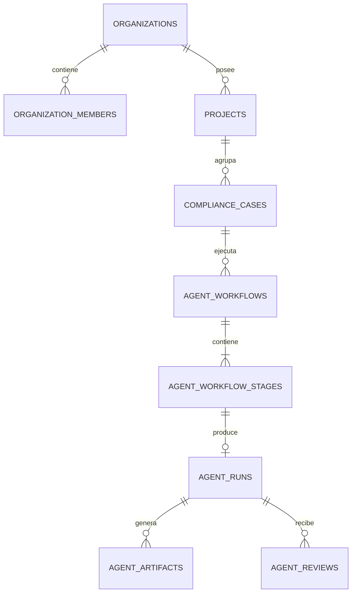

# Datos y Supabase

## Modelo multiempresa

La unidad de aislamiento es `organization_id`. El usuario accede a una organización mediante `organization_members`; su perfil y workspace activo deben ser coherentes con esa membresía.

## Dominios de datos

| Dominio | Entidades observadas |
|---|---|
| Identidad | profiles, organizations, organization_members |
| Trabajo | projects, compliance_cases, case events, missions |
| Agentes | agent_workflows, agent_workflow_stages, agent_jobs, agent_runs, agent_artifacts, agent_reviews |
| Assurance | controls, control_evaluations, evidence, evidence_requests |
| Privacidad | organization_processes, processing_activity_reviews, lifecycle, notice, remediation y deletion evidence |
| Conocimiento | documentos, contexto, memoria, precedentes y grafo |
| Regulatorio | fuentes, capturas, snapshots, hechos, claims y proyecciones |
| Operación | alertas, actividad, tareas, ownership y SLA |
| Plataforma | telemetría IA, trazas de proveedor y assurance de tenant |

La lista es una vista por familias. El esquema autoritativo es la secuencia completa de migraciones aplicada en Supabase.

## Invariantes

- Todo registro tenant-scoped debe incluir o derivar una organización.
- Los IDs recibidos del cliente se vuelven a comprobar contra la organización activa.
- Una revisión parcial conserva desconocidos explícitos.
- Una revisión completa no puede conservar desconocidos abiertos.
- Las acciones idempotentes usan claves de solicitud y rechazan reutilización con contenido distinto.
- Los reintentos no borran historia: superseden artefactos.
- El cierre de casos, aprobación de runs y creación de líneas base se ejecutan atómicamente.
- Los jobs terminales no permanecen activos.
- Los hashes de integridad se almacenan como evidencia, no como sustituto del contenido fuente.

## Acceso

### Cliente autenticado

Usa `createClient()` server-side o el cliente browser y queda sometido a RLS.

### Cliente administrativo

`createAdminClient()` es exclusivo de servidor. Su uso exige comprobar previamente:

1. autenticación;
2. membresía;
3. organización activa;
4. rol/capacidad;
5. pertenencia tenant de cada recurso.

### RPC

Las RPC encapsulan transacciones complejas e idempotentes. Las funciones `SECURITY DEFINER` deben:

- fijar `search_path`;
- restringir `EXECUTE`;
- bloquear roles browser cuando corresponda;
- volver a validar actor, organización y estado;
- dejar evidencia auditable.

## Evolución

Las migraciones están ordenadas por timestamp en `supabase/migrations/`. No se edita una migración aplicada: se agrega una nueva migración forward-only con verificación y, para cambios riesgosos, reversión operacional explícita.

## Fuentes regulatorias

El sistema contiene pipelines para LeyChile, Diario Oficial, Dirección del Trabajo, SMA/SNIFA, Mercado Público y SST/DS44. La captura separa:

- fuente y fetch;
- snapshot inmutable;
- parseo;
- hechos o claims;
- revisión y proyección;
- evidencia de origen e integridad.
