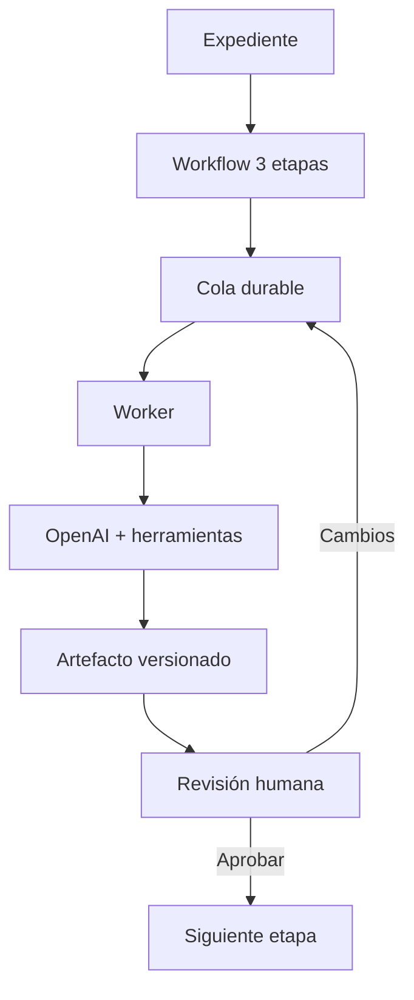

# Agentes y workflows

## Modelo

Los agentes visibles son especialistas de cumplimiento. Travis es un agente interno de ingeniería y no forma parte del producto cliente.

El núcleo productivo vigente usa tres especialistas y revisión humana por etapa. El catálogo, prompts y routing viven en `lib/agents/`.

## Entidades

- `agent_workflows`: ejecución completa asociada a un caso.
- `agent_workflow_stages`: etapas ordenadas y su estado.
- `agent_jobs`: cola durable, leases, intentos y dead letter.
- `agent_runs`: una ejecución de modelo.
- `agent_artifacts`: salida persistida y versionada.
- `agent_reviews`: decisión humana.
- eventos del caso: historia auditable de transiciones.

## Estados y avance

1. Crear workflow y etapas.
2. Encolar la etapa actual mediante RPC.
3. Worker adquiere job compatible.
4. Ejecutar especialista con contexto acotado.
5. Persistir run y artefacto.
6. Marcar etapa pendiente de revisión.
7. Humano aprueba o solicita cambios.
8. El sistema avanza, reintenta o completa.

## Garantías

- Un workflow terminal no vuelve a ejecutarse.
- Una etapa no se duplica si ya produjo resultado.
- El reintento exige instrucciones cuando hubo cambios solicitados.
- `max_attempts` limita reintentos.
- El job usa lease y recuperación de estado stale.
- Artefactos reemplazados quedan superseded, no borrados.
- La revisión y el avance usan operaciones atómicas.
- El cierre exige 3/3 aprobados.
- La cola final debe quedar sin jobs activos ni dead letters.

## Grounding y herramientas

Los agentes pueden usar fuentes y herramientas registradas, pero deben conservar trazabilidad. La capa SST/regulatoria aplica aislamiento por dominio para evitar mezclar reglas no pertinentes al caso.

## Telemetría

Se registran tokens, tiempo acumulado y trazas mínimas del proveedor. La telemetría ayuda a operación y costos; no debe almacenar prompts, documentos o respuestas completas innecesarias.

## Recuperación

La UI puede detectar workflows detenidos y ofrecer recuperación. El backend distingue:

- queued;
- leased;
- retry_wait;
- succeeded;
- dead_letter.

La recuperación no debe saltarse revisión ni crear una ejecución paralela del mismo stage.
