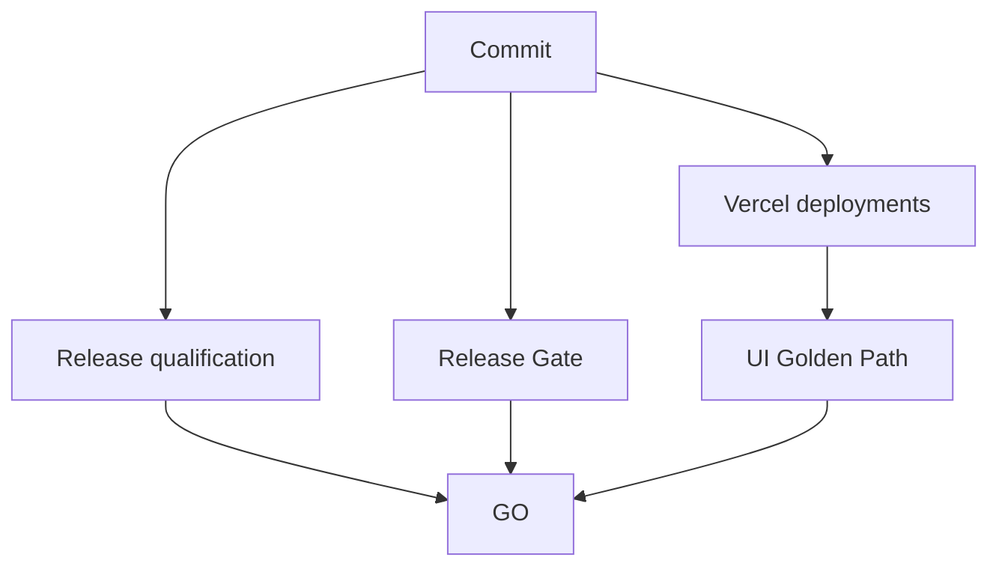

# Operación y despliegue

## Entornos

- Desarrollo local con `npm run dev`.
- Preview por cambio/PR en Vercel.
- Producción desde `main`.
- Supabase como backend compartido por el entorno configurado.

## Comandos base

```bash
npm ci
npm run typecheck
npm run build
npm run release:check
npm run smoke
```

Los checks especializados se ejecutan mediante los scripts `check:*` definidos en `package.json`.

## Pipeline de release



## Gates

### Release qualification

Instala desde lockfile, valida boundaries, fixtures, producto, typecheck, build y smoke server.

### Release Gate

Bloquea vulnerabilidades críticas y ejecuta el contrato de release.

### UI Golden Path

- espera ambos despliegues Vercel;
- obtiene OIDC;
- provisiona identidad sintética;
- recorre producción por UI;
- valida 3 etapas/runs/artefactos/revisiones;
- verifica misión, evidencia, línea base y actividad de tratamiento;
- publica artefacto y commit status.

## Salud

`/api/health` y `/api/readiness` son las fronteras para inspección automatizada. Los errores se registran sin volcar secretos ni cargas sensibles.

## Operación diaria

- Revisar alertas y actividad.
- Revisar jobs activos y dead letters.
- Resolver workflows stale.
- Verificar crons regulatorios y reintentos.
- Revisar errores de runtime y despliegue.
- Confirmar que capturas regulatorias tienen snapshot y evidencia.
- Mantener responsables y SLA.
- Evitar acumulación de identidades/datos E2E según su política de lifecycle.

## Rollback

1. Identificar el último SHA verde.
2. Evaluar compatibilidad con migraciones ya aplicadas.
3. Revertir código mediante commit, no moviendo historia destructivamente.
4. Para datos, usar una migración correctiva forward-only.
5. Ejecutar gates y smoke.
6. Documentar causa, impacto y recuperación.

## Ownership de Vercel

El sistema observa dos proyectos Vercel como requisito de producción. Cualquier consolidación o cambio de ownership debe actualizar el workflow, la documentación de operación y la decisión versionada correspondiente.
